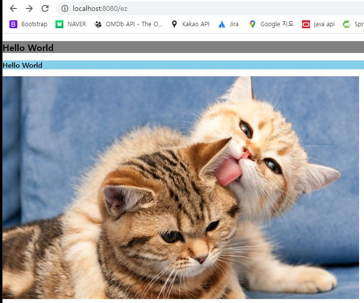

# 🐘 Spring 폴더구조

- ## src/main/java : JAVA 소스만!

- ## resources : html, css, js, image, sql 파일

<br>

## 🐘 build.gradle

```java
plugins {
	id 'java'
	id 'org.springframework.boot' version '2.7.5'
	id 'io.spring.dependency-management' version '1.0.15.RELEASE'
}

group = 'com.example'
version = '0.0.1-SNAPSHOT'
sourceCompatibility = '11'

repositories {
	mavenCentral()
}

dependencies {
	implementation 'org.springframework.boot:spring-boot-starter-web'
	testImplementation 'org.springframework.boot:spring-boot-starter-test'
    // 추가내용
	implementation 'org.springframework.boot:spring-boot-starter-thymeleaf'
	// 실시간으로 화면 수정
developmentOnly 'org.springframework.boot:spring-boot-devtools'
}

tasks.named('test') {
	useJUnitPlatform()
}
```

<br>

## < src/main/java - com.example.demo >

## 🐘 MainController.java

```java
package com.example.demo;

import org.springframework.web.bind.annotation.GetMapping;
import org.springframework.web.bind.annotation.RestController;

@RestController
public class MainController {

	@GetMapping("/hello")
	public String callHomepage() {

		return "Hello World~!";
	}
}
```

<br>

## 🐘 PageController.java

```java
package com.example.demo;

import org.springframework.stereotype.Controller;
import org.springframework.web.bind.annotation.GetMapping;

@Controller
public class PageController {

	@GetMapping("/ez")
	public String callIndexPage() {
		// return에 html파일 이름을 작성
		return "index";
	}
}
```

<br>

## < src/main/resources - templates >

## 🌈 index.html

```html
<!DOCTYPE html>
<html>
  <head>
    <meta charset="UTF-8" />
    <title>Insert title here</title>
    <link rel="stylesheet" type="text/css" href="/css/style.css" />
  </head>
  <body>
    <h2>Hello World</h2>
    <h3>Hello World</h3>
    
  </body>
  <script src="/js/index.js"></script>
</html>
```

<br>

## < src/main/resources - static - css/images/js>

## 🌈 style.css

```css
body {
  margin: 0;
  padding: 0;
  box-sizing: border-box;
}
h2 {
  background-color: grey;
}
h3 {
  background-color: skyblue;
}
```

<br>

## 🌈 index.js

```javascript
console.log('Hello World!');
```

## 🌈 결과물

<br>
<div align=center>  
    
</div>
